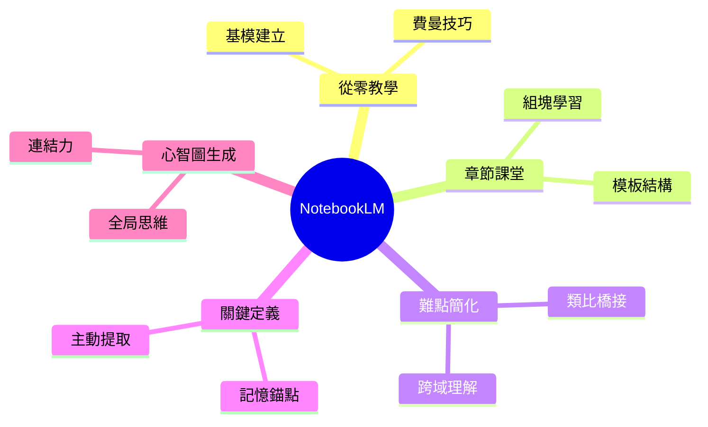

# NotebookLM × 啟發思維模式
## 5 個將文件轉化為真實課堂的 Prompt｜5 Prompts That Turn Files Into Real Classes

> 來源：@create_daniel2 × @wilson_pro_ai（Instagram）
> 核心理念：文件不是終點，是學習的起點。
> 適用工具：NotebookLM、Claude、ChatGPT（任何支援文件上傳的 AI）

---

## 思維框架總覽｜Mental Model Overview

```
文件（Raw File）
 │
 ▼
┌─────────────────────────────────────┐
│ 5 種認知轉化模式                    │
│                                     │
│ 1. 零基礎教學 → 建立基模            │
│ 2. 章節課堂化 → 結構化吸收          │
│ 3. 難點簡化   → 突破認知障礙        │
│ 4. 關鍵詞萃取 → 記憶錨點建構        │
│ 5. 心智圖生成 → 全局觀與連結力      │
└─────────────────────────────────────┘
 │
 ▼
真實理解（Real Understanding）
```

---

## Prompt 1｜從零開始教我 Teach Me from Zero
*圖片序號：2/7*

### 原文 Prompt（英）
> "Transform this document into a guided class. Explain everything step by step, starting with the most basic concepts and gradually advancing to intermediate and advanced levels. Start from the basis that this is my first time learning this topic."

### 中文翻譯
> 「將這份文件轉化為一堂引導式課程。從最基礎的概念開始，逐步推進至中階與進階內容，逐步講解每個環節。請以『這是我第一次接觸這個主題』為前提來進行說明。」

### 啟發思維｜Thinking Insight

核心認知模型：費曼技巧（Feynman Technique）

> 如果你無法用簡單語言解釋一個概念，代表你還沒真正理解它。

| 層次 | 英文 | 說明 |
|------|------|------|
| 初學者心態 | Beginner's Mind | 放下既有假設，重新建立正確基模 |
| 漸進複雜度 | Progressive Complexity | 避免一次性認知超載（Cognitive Overload） |
| 引導式課堂 | Guided Class | 被動閱讀 → 主動學習的轉換 |

**使用場景：**
- 接觸新領域技術文件（如 FHIR、CQL、COBOL）
- 閱讀規範說明書前的熱身理解
- 跨領域知識遷移

---

## Prompt 2｜按章節結構化課堂 Structured Classes by Chapter
*圖片序號：3/7*

### 原文 Prompt（英）
> "Divide this document into parts and transform each section or chapter into an independent mini LLM class. Explain the main points clearly, add practical examples, and end each part with a quick summary to reinforce learning."

### 中文翻譯
> 「將這份文件拆分成段落，並將每個章節或部分轉化為一堂獨立的迷你 LLM 課程。清楚說明重點，加入實際案例，並在每個段落結尾附上快速摘要以強化學習。」

### 啟發思維｜Thinking Insight

核心認知模型：組塊學習法（Chunking）

> 大腦的工作記憶有限，將長文切割為「獨立模塊」能大幅提升保留率。

**章節結構模板 Chapter Template：**

```
┌──────────────────────────────┐
│ 🎯 本章主旨 Main Point       │
│ 📖 概念說明 Explanation      │
│ 🔧 實際案例 Practical Example│
│ ✅ 快速摘要 Quick Summary    │
└──────────────────────────────┘
```

**使用場景：**
- 厚重規格文件（如疾管署說明書、HL7 FHIR 規範）
- 培訓教材設計
- 個人學習筆記系統建構

---

## Prompt 3｜簡化困難內容 Simplify Difficult Content
*圖片序號：4/7*

### 原文 Prompt（英）
> "Analyze this document and identify the most complex or confusing parts. Re-explain them using simple language, easy-to-understand analogies, or real-world examples so everything becomes clearer."

### 中文翻譯
> 「分析這份文件，找出最複雜或最令人困惑的部分。用簡單語言、易於理解的類比或真實世界的例子重新解釋這些內容，使一切變得更清晰。」

### 啟發思維｜Thinking Insight

核心認知模型：類比橋接（Analogy Bridging）

> 新知識必須與既有知識建立連結，才能進入長期記憶。

| 抽象概念 | 類比橋接 | 理解效果 |
|----------|----------|----------|
| ValueSet（FHIR） | 黑名單／白名單清單 | 即時理解過濾機制 |
| Context Window | 工作桌面大小 | 直觀理解記憶限制 |
| CQL 邏輯 | Excel 篩選條件 | 降低技術門檻 |
| MCP 協議 | 標準插頭規格 | 理解互通性概念 |

**使用場景：**
- 法規/規範文件（複雜條文解析）
- 跨領域溝通（技術概念向非技術受眾說明）
- 自我確認是否真正理解某個概念

---

## Prompt 4｜關鍵概念與核心定義 Key Concepts and Essential Definitions
*圖片序號：5/7*

### 原文 Prompt（英）
> "Analyze this document and identify all the fundamental ideas, terms, and notions. Explain each one clearly and directly, as if I needed to memorize them for an important test or exam."

### 中文翻譯
> 「分析這份文件，找出所有基礎概念、術語與觀念。清楚、直接地逐一解釋每一個，如同我需要為一場重要的測試或考試記住它們一樣。」

### 啟發思維｜Thinking Insight

核心認知模型：間隔重複 + 主動提取（Spaced Repetition + Active Recall）

> 記憶的關鍵不在於「讀了幾遍」，而在於「主動提取了幾次」。

**術語卡片結構 Flashcard Structure：**

```
┌─────────────────────────────────┐
│ 術語 Term：CDS Hooks            │
│ 定義 Definition：臨床決策支援   │
│   觸發介面標準                  │
│ 應用 Application：於 FHIR 伺服器│
│   回應臨床事件                  │
│ 記憶錨點 Anchor：「醫療版 Webhook」│
└─────────────────────────────────┘
```

**使用場景：**
- 新進入一個技術領域前建立詞彙庫
- 準備技術審查或客戶簡報
- 建立個人知識詞典（Personal Glossary）

---

## Prompt 5｜自動生成心智圖 Automatic Mind Map
*圖片序號：6/7*

### 原文 Prompt（英）
> "Transform the content of this document into a structured mind map, connecting main ideas, secondary concepts, and important relationships to facilitate memorization."

### 中文翻譯
> 「將這份文件的內容轉化為結構化的心智圖，連接主要概念、次要概念與重要關係，以促進記憶。」

### 啟發思維｜Thinking Insight

核心認知模型：全局思維（Systems Thinking）

> 孤立的知識點容易遺忘；有連結的知識網絡才能持久。

**心智圖輸出範例（Mermaid 格式）：**



**使用場景：**
- 讀完長篇文件後的全局整理
- 教學設計與課程架構規劃
- 團隊知識分享與視覺化溝通

---

## 五種 Prompt 對照速查表｜Quick Reference

| # | 名稱 | 核心目的 | 認知模型 | 最佳應用場景 |
|---|------|----------|----------|-------------|
| 1 | Teach Me from Zero | 建立基模 | 費曼技巧 | 新領域入門 |
| 2 | Structured by Chapter | 結構吸收 | 組塊學習 | 規範文件拆解 |
| 3 | Simplify Difficult Content | 突破障礙 | 類比橋接 | 複雜概念理解 |
| 4 | Key Concepts & Definitions | 建立詞彙庫 | 主動提取 | 技術審查備考 |
| 5 | Automatic Mind Map | 建立全局觀 | 系統思維 | 知識整合輸出 |

---

## 進階應用：組合使用策略｜Advanced: Combo Strategy

建議工作流程（針對厚重技術文件）：

```
Step 1：上傳文件至 NotebookLM / Claude
 ↓
Step 2：Prompt 4 → 先萃取關鍵術語，建立詞彙基礎
 ↓
Step 3：Prompt 1 → 從零教學，建立整體理解框架
 ↓
Step 4：Prompt 2 → 按章節深入，逐一消化各段落
 ↓
Step 5：Prompt 3 → 針對仍有疑惑的部分，要求類比解釋
 ↓
Step 6：Prompt 5 → 最終生成心智圖，鞏固全局連結
 ↓
 輸出：可複用的結構化學習筆記
```

---

## 思維模式啟發｜The Bigger Insight

> 文件的價值，不在於它被「讀完」，而在於它被「消化成思維」。

這 5 個 Prompt 的本質，是五種「認知轉化策略」：

- **轉化輸入模式：** 從被動閱讀 → 主動提問
- **轉化記憶方式：** 從線性瀏覽 → 網絡連結
- **轉化理解深度：** 從表面識別 → 能夠重新解釋
- **轉化輸出形式：** 從「我讀過了」→「我能夠教別人」

> *"The best way to learn is to teach."*
> 最好的學習，是能夠教給別人。

---

*來源：@create_daniel2 × @wilson_pro_ai | 整理：Hungtao Liu*
